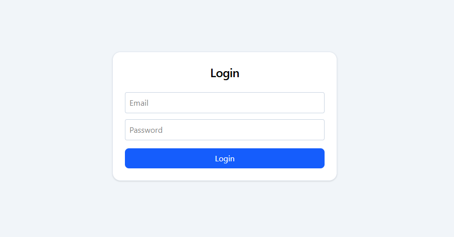
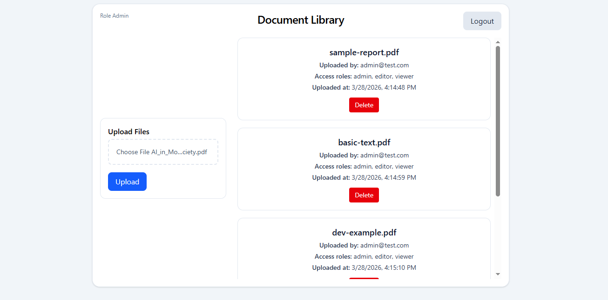
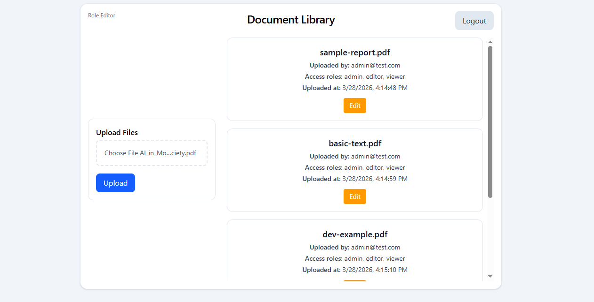
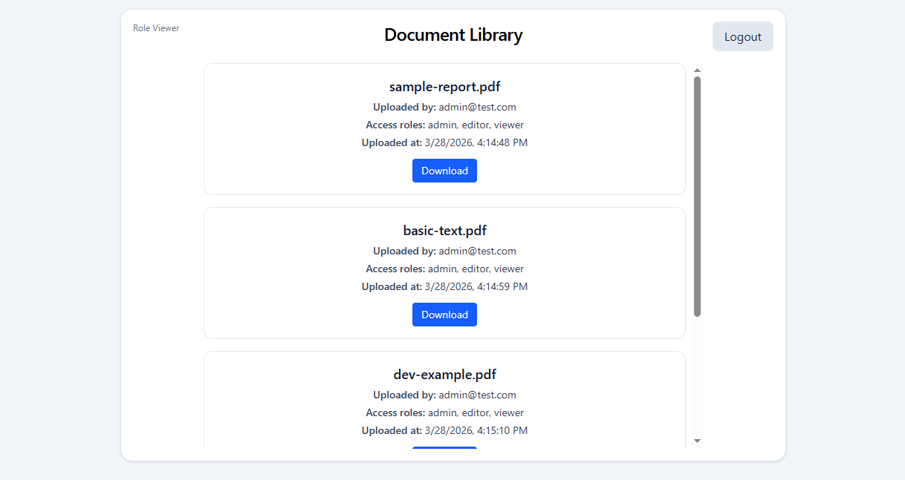

# 📚 Access-Controlled Digital Library

## 🚀 Project Overview

The **Access-Controlled Digital Library** is a full-stack web application that demonstrates secure document management using **JWT-based authentication** and **Role-Based Access Control (RBAC)**.

The system ensures that users can only perform actions permitted by their role, with enforcement handled at the backend and reflected in the frontend interface.

---

## 🎯 Objectives

This project was built to:

* Implement secure authentication using JWT
* Enforce role-based authorization (RBAC)
* Provide a structured document management workflow
* Demonstrate backend-driven security with frontend role awareness
* Apply full-stack development best practices

---

## ✨ Key Features

* Secure login with JWT authentication
* Role-based access control (Admin, Editor, Viewer)
* Backend-protected API endpoints using FastAPI dependencies
* Role-aware frontend interface
* Document upload (with file storage)
* Document metadata update
* Document deletion with file cleanup
* Document download support
* SQLite database for metadata
* Local file storage (`uploads/`)

---

## 🛠 Tech Stack

### Backend

* FastAPI
* SQLAlchemy
* SQLite
* PyJWT
* Passlib (bcrypt)
* python-dotenv
* python-multipart

### Frontend

* React (Vite)
* TypeScript
* Tailwind CSS

---

## 👥 System Roles

| Role       | Description                                                 |
| ---------- | ----------------------------------------------------------- |
| **Admin**  | Upload documents, delete documents, and access admin-only routes |
| **Editor** | Can upload documents and update metadata                    |
| **Viewer** | Log in and use viewer-level document actions such as download                               |

---

## 🔐 Role Permissions

| Action             | Admin | Editor | Viewer |
| ------------------ | ----- | ------ | ------ |
| Login              | ✅     | ✅      | ✅      |
| View documents     | ✅     | ✅      | ✅      |
| Upload documents   | ✅     | ✅      | ❌      |
| Update metadata    | ❌     | ✅      | ❌      |
| Delete documents   | ✅     | ❌      | ❌      |
| View users         | ✅     | ❌      | ❌      |

---
## Role Setup / Demo Accounts

This project uses three predefined demo users stored in the backend for evaluation purposes.

| Role   | Email            | Password  |
| ------ | ---------------- | --------- |
| Admin  | admin@test.com   | admin123  |
| Editor | editor@test.com  | editor123 |
| Viewer | viewer@test.com  | viewer123 |

These accounts are hardcoded in the backend and are used to demonstrate RBAC behavior during testing.


## 🏗️ Architecture Summary

The application follows a **client-server architecture**:

* **Frontend (React)**
  Handles authentication state, UI rendering, and role-based interactions.

* **Backend (FastAPI)**
  Handles authentication, JWT validation, RBAC enforcement, and API logic.

* **Database (SQLite)**
  Stores document metadata.

* **File Storage**
  Uploaded files are stored locally in the `uploads/` directory.

---

## 📂 Project Structure

```text
access-controlled-digital-library/
├── backend/
│   ├── app/
│   │   ├── api/routes/
│   │   │   ├── auth.py
│   │   │   ├── documents.py
│   │   │   └── users.py
│   │   ├── core/
│   │   │   ├── config.py
│   │   │   ├── database.py
│   │   │   ├── deps.py
│   │   │   └── security.py
│   │   ├── models/
│   │   │   ├── document.py
│   │   │   └── user.py
│   │   ├── schemas/
│   │   │   ├── auth.py
│   │   │   └── documents.py
│   │   └── main.py
│   ├── uploads/
│   ├── library.db
│   ├── requirements.txt
│   └── .env
│
├── frontend/
│   ├── src/
│   │   ├── context/AuthContext.tsx
│   │   ├── pages/Login.tsx
│   │   ├── pages/Documents.tsx
│   │   ├── App.tsx
│   │   └── main.tsx
│
└── README.md
```

---

## ⚙️ Setup Instructions

### 🔹 Prerequisites

* Python 3.10+
* Node.js 18+
* npm

---

### 🔹 Backend Setup

  1. Open a terminal in the backend directory.
  2. Create and activate a virtual environment.
  3. Install dependencies.
  4. Run the API server.

```bash
cd backend
python -m venv venv
venv\Scripts\activate   # Windows
source venv/bin/activate   # Linux/macOS


pip install -r requirements.txt
```

Create `.env` file:

```env
SECRET_KEY=your-secret-key
ALGORITHM=HS256
ACCESS_TOKEN_EXPIRE_MINUTES=60
```

Run backend:

```bash
uvicorn app.main:app --reload
```

Backend URL:

```
http://127.0.0.1:8000
```

---

### 🔹 Frontend Setup

  1. Open a second terminal in the frontend directory.
  2. Install dependencies.
  3. Start the development server.

```bash
cd frontend
npm install
npm run dev
```

Optional `.env`:

```env
VITE_API_BASE_URL=http://127.0.0.1:8000
```

Frontend URL:

```
http://localhost:5173
```

---

## 🔐 Authentication Flow

1. User submits login credentials
2. Backend validates credentials
3. JWT token is generated with:

   * `sub` (email)
   * `role`
   * `exp`
4. Token is returned to frontend
5. Frontend stores token **in memory (React Context)**
6. Protected requests include:

```
Authorization: Bearer <token>
```

---

## 🛡️ RBAC Implementation

RBAC is enforced using FastAPI dependencies:

```python
require_role(["admin", "editor"])
```

* Validates user role from JWT
* Returns **403 Forbidden** if unauthorized
* Centralized and reusable design

---

## 📄 API Endpoints

### 🔐 Authentication

| Method | Endpoint    | Access |
| ------ | ----------- | ------ |
| POST   | /auth/login | Public |

---

### 📄 Documents

| Method | Endpoint                 | Access        |
| ------ | ------------------------ | ------------- |
| GET    | /documents               | Public        |
| GET    | /documents/{id}          | Public        |
| POST   | /documents               | Admin, Editor |
| PATCH  | /documents/{id}          | Editor        |
| DELETE | /documents/{id}          | Admin         |
| GET    | /documents/{id}/download | Authenticated |

---

### 👥 Users

| Method | Endpoint | Access |
| ------ | -------- | ------ |
| GET    | /users   | Admin  |

---

## 🖥️ Frontend Behavior

* JWT stored securely in memory
* Role-based UI rendering:

  * Admin → delete access
  * Editor → edit access
  * Viewer → read-only
* Upload available for Admin & Editor
* Dynamic UI updates based on role

---

# 📷 Screenshots





## 🔐 Security Considerations

* JWT authentication with expiration
* Bearer token validation
* Password hashing using bcrypt
* Proper HTTP status codes (401 / 403)
* Environment-based configuration
* No localStorage usage for tokens


---

## 📄 License

This project is for educational purpose.

---
